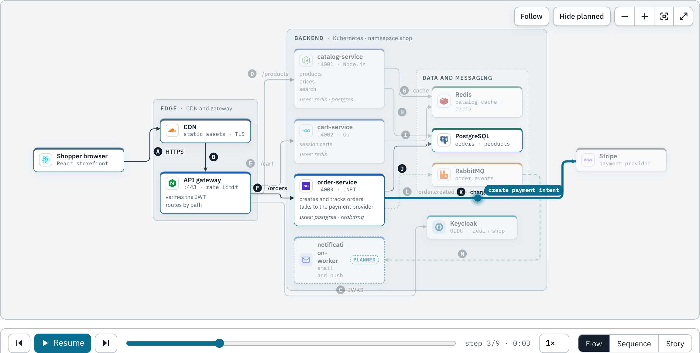
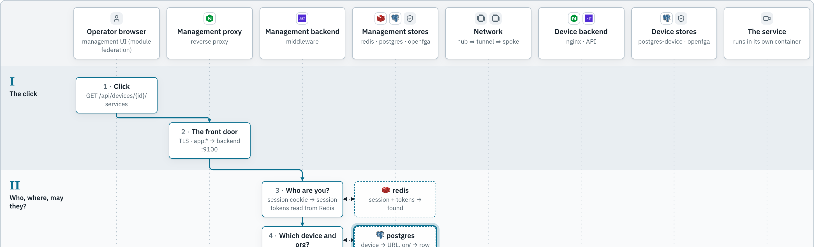
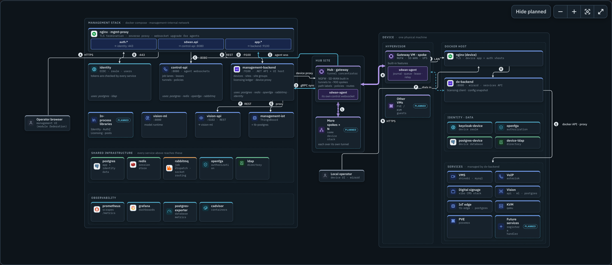

<div align="center">

# docspp

**Architecture diagrams your readers can play.**

Describe a system in YAML. Get a clean, interactive diagram with markdown docs behind every box, and scenarios that show a request travelling through it, step by step.

[](https://github.com/AhmeddBasemm/docspp/actions/workflows/ci.yml)
[](https://www.npmjs.com/package/create-docspp)
[](LICENSE)
[](https://nodejs.org)
[](CONTRIBUTING.md)

[Documentation](https://ahmeddbasemm.github.io/docspp/) ·
[Live examples](https://ahmeddbasemm.github.io/docspp/examples/platform/) ·
[Report a bug](https://github.com/AhmeddBasemm/docspp/issues/new?template=bug_report.yml) ·
[Request a feature](https://github.com/AhmeddBasemm/docspp/issues/new?template=feature_request.yml)

<br>



</div>

## Why docspp

Architecture diagrams go stale because they are pictures. docspp keeps the system as data, so the diagram, the docs and the walkthroughs come from one place that lives in your repository and changes in the same pull request as the code.

- **Declarative.** Nodes, groups and edges in `diagram.yaml`. No coordinates: layout is automatic and steerable with a few hints.
- **Scenarios.** Any number per diagram: the happy path, a cache miss, a declined card. Each plays as packets over the architecture, as a sequence diagram, or as a swimlane story, with a step list, scrubbing, speed control and shareable deep links.
- **One model, many views.** Write a node once; show it in an overview, a backend-only view, a per-team view.
- **Docs inside the picture.** Click a box for its markdown, connections and source references. Edge keys link to an interfaces table generated from the model.
- **Icons.** Brand logos for your stack (`postgresql`, `redis`, `keycloak`…), [Lucide](https://lucide.dev) for the rest, and your own SVGs. Bundled at build time, nothing fetched at runtime.
- **A real docs site.** Astro and Starlight: markdown pages, search, light and dark themes, static output you can host anywhere, GitHub Pages included.
- **Written to be generated.** A JSON Schema for your editor, a CLI whose errors say `file:line:col` and suggest fixes, and a skill that teaches AI agents the format.

<div align="center">

<br>
<sub>The same scenario as a swimlane story.</sub>
<br><br>

<br>
<sub>Large systems, grouped into zones, in the dark theme.</sub>
</div>

## Quick start

You need Node 22 or newer.

```sh
npm create docspp@latest my-docs
cd my-docs
pnpm install
pnpm dev
```

Open the address it prints, then edit `diagrams/shop/diagram.yaml`. Save, and the page reloads.

```yaml
nodes:
  browser: { kind: client, title: Browser }
  api:     { kind: service, icon: nodejs, title: API, sub: ":3000" }
  db:      { kind: database, icon: postgresql, title: Database }

edges:
  - browser -> api: HTTPS
  - api -> db: { kind: data, label: SQL }

scenarios:
  load-page:
    title: Load a page
    steps:
      - browser -> api: GET /items
      - api -> db: { label: SELECT, kind: lookup }
      - db -> api: rows
      - api -> browser: 200 OK
```

That is a diagram with three boxes, two connections and one scenario a reader can play. The [getting started guide](https://ahmeddbasemm.github.io/docspp/guides/getting-started/) goes on from here.

### Check your work

```sh
pnpm check                  # validate every diagram; errors point at file:line:col
pnpm docspp check --strict  # treat warnings as errors, for CI
```

## Documentation

| Guide | What it covers |
|---|---|
| [Getting started](https://ahmeddbasemm.github.io/docspp/guides/getting-started/) | create a project, add a diagram, publish it |
| [Writing diagrams](https://ahmeddbasemm.github.io/docspp/guides/writing-diagrams/) | nodes, groups, edges, views and layout hints |
| [Scenarios](https://ahmeddbasemm.github.io/docspp/guides/scenarios/) | step types, parallel steps, flow, sequence and story views |
| [Icons and theming](https://ahmeddbasemm.github.io/docspp/guides/icons-and-theming/) | icon sets, your own SVGs, the `--docspp-*` CSS tokens |
| [Authoring with AI](https://ahmeddbasemm.github.io/docspp/guides/ai-authoring/) | the schema, the CLI and the skill |

Live, playable examples: [checkout](https://ahmeddbasemm.github.io/docspp/examples/checkout/), [platform](https://ahmeddbasemm.github.io/docspp/examples/platform/) and [payments](https://ahmeddbasemm.github.io/docspp/examples/payments/).

## Use it with an AI agent

```sh
npx skills add AhmeddBasemm/docspp --skill docspp
```

The [skills](https://skills.sh) installer puts the **docspp skill** into your project for Claude Code, Cursor, Copilot and other agents. It knows how to set docspp up, the whole diagram format, how to write scenarios and stories, and how to fix layout and errors. Projects from the starter template already include it. The skill lives in [`skills/docspp`](skills/docspp).

## Packages

Everything is published to npm and versioned together.

| Package | Purpose |
|---|---|
| [`create-docspp`](https://www.npmjs.com/package/create-docspp) | `npm create docspp`: scaffolds a project from the starter template |
| [`docspp`](https://www.npmjs.com/package/docspp) | the command line: `check`, `list`, `schema`, `icons search` and `new` |
| [`@packagelab/docspp-core`](https://www.npmjs.com/package/@packagelab/docspp-core) | schema, compiler, layout, edge router, scenario timeline. The main entry is browser-safe |
| [`@packagelab/docspp-react`](https://www.npmjs.com/package/@packagelab/docspp-react) | the `DiagramView` component and its styles |
| [`@packagelab/docspp-astro`](https://www.npmjs.com/package/@packagelab/docspp-astro) | the Astro integration and the `<Diagram>` component |

## How it works

```
 diagram.yaml ─┐
 nodes/*.md ───┼─▶  compile  ─▶  layout  ─▶  render
 scenarios/ ───┘    (validate)    (ELK +      (React, SVG,
                                   router)     pan and zoom)
```

1. **Compile.** The YAML is validated against a [zod](https://zod.dev) schema and normalised into a JSON-serialisable model. Mistakes are reported with file, line and column.
2. **Layout.** Groups are laid out bottom up with [ELK](https://github.com/kieler/elkjs), and a small A\* router draws the orthogonal edges between them.
3. **Render.** A React component draws the result and plays scenarios. The timeline and the story model are pure functions of the compiled diagram, so what you see at any step is reproducible.

The Astro integration does the compile step at build time, so readers download a static page.

## Repository layout

A monorepo: the tool, its documentation and its starter project change together.

| Path | Contents |
|---|---|
| [`packages/`](packages) | `core`, `react`, `astro`, `cli` and `create-docspp` |
| [`apps/docs`](apps/docs) | the landing page, guides and live examples (also the end-to-end tests) |
| [`templates/starter`](templates/starter) | the project new users start from |
| [`skills/docspp`](skills/docspp) | the agent skill |
| [`scripts/`](scripts) | build, template and release tooling |
| [`docs/`](docs) | design notes: [PLAN.md](docs/PLAN.md) and [REPOSITORIES.md](docs/REPOSITORIES.md) |

## Development

```sh
pnpm install
pnpm dev              # the docs site, http://localhost:4321
pnpm dev:template     # the starter project
pnpm test             # unit tests
pnpm test:e2e         # builds the docs and drives them in Chrome (needs Google Chrome)
pnpm verify:pack      # packs everything and installs it the way a user would
pnpm lint             # Biome
pnpm typecheck
```

Needs Node 22 or newer and [pnpm](https://pnpm.io). [CONTRIBUTING.md](CONTRIBUTING.md) has the full workflow, and [CLAUDE.md](CLAUDE.md) holds the rules for working on the tool with an AI agent.

## Roadmap

Where docspp is heading, roughly in order. The reasoning is in [docs/PLAN.md](docs/PLAN.md).

- [ ] Automated releases from the main branch
- [ ] More diagram types: state machines and entity relationships
- [ ] Forked scenarios (a step that branches into outcomes)
- [ ] Visual regression tests for layout
- [ ] Export to SVG, PNG and GIF
- [ ] Layout in a web worker for very large diagrams
- [ ] Import from Mermaid and OpenAPI
- [ ] An MCP server for agents

Ideas and votes are welcome in [issues](https://github.com/AhmeddBasemm/docspp/issues).

## Contributing

Contributions of all sizes are welcome: a typo, a bug report, a new icon mapping, a feature. Start with [CONTRIBUTING.md](CONTRIBUTING.md), which covers setup, the checks to run and how changes are released. Everyone taking part is expected to follow the [Code of Conduct](CODE_OF_CONDUCT.md). To report a vulnerability, read [SECURITY.md](SECURITY.md) and do not open a public issue.

## Contributors

docspp is created and maintained by [Ahmed Basem](https://github.com/AhmeddBasemm), and shaped by everyone who files an issue, sends a pull request or improves the docs. See [CONTRIBUTORS.md](CONTRIBUTORS.md) for the people behind the project, and the [contributors graph](https://github.com/AhmeddBasemm/docspp/graphs/contributors) for the full history.

[](https://github.com/AhmeddBasemm/docspp/graphs/contributors)

## License

docspp is released under the [MIT License](LICENSE). You can use it in personal, commercial and closed-source projects. Contributions are accepted under the same license.

### Acknowledgements

docspp stands on open source work, and bundles some of it:

- [Iconify](https://iconify.design) icon sets: [`logos`](https://github.com/gilbarbara/logos) and [Simple Icons](https://simpleicons.org) (CC0-1.0), and [Lucide](https://lucide.dev) (ISC).
- [ELK](https://github.com/kieler/elkjs) for layout (EPL-2.0 OR GPL-3.0-or-later), [zod](https://zod.dev) (MIT), [yaml](https://github.com/eemeli/yaml) (ISC), [Astro](https://astro.build) and [Starlight](https://starlight.astro.build) (MIT), [React](https://react.dev) and [d3](https://d3js.org) for rendering and zoom.

Brand logos shown in diagrams are trademarks of their respective owners, used only to identify the technologies a diagram describes. Their presence does not imply any endorsement of, or affiliation with, docspp.
